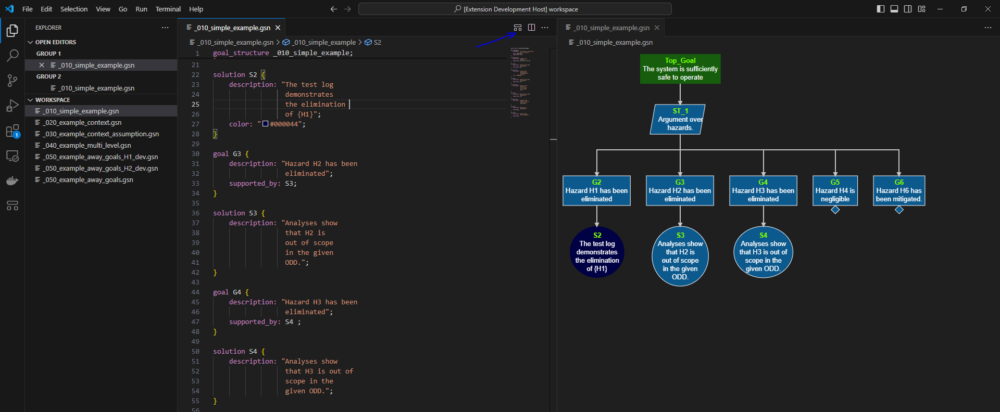

Below is the documentation of the VSCode plugin for modeling structured safety cases using the *Goal Structuring Notation*.

Installation
------------

The plugin available on the `VSCode Marketplace <https://marketplace.visualstudio.com/items?itemName=DanielRatiu.goal-structuring-notation-extension/>`_.
If you already have VSCode installed, then just install the "Goal Structuring Notation Language" plugin.

Usage
-------

Once the plugin is installed, you can create files with the extension "gsn" which will be automatically recognized as structured arguments using the
`Goal Structuring Notation <https://scsc.uk/gsn?page=gsn%202standard>`_ language. 

Once the argument is modeled in textual notation, you can open the correspondign diagram by pressing the icon marked with the blue arrow in the image below.
The diagram will open in a new window which can be dragged for example to the right to have a side-by-side representation of the argument.
All modifications of the argument, after saved, will be reflected in the diagram.

To export the diagram into a SVG, you need to select the window containing the diagram and press 'Alt + E'. A window will popup and ask for the location and 
filename where the SVG is to be saved.

Animated center selection is enabled with 'Alt-C' and fit to screen with 'Alt-F'.

Example Repositories
--------------------

* An example repository featuring all language features - `Demo_Safety_Case <https://github.com/Assurance-Workbench/Demo_Safety_Case>`_ 
* A repository containing assurance arguments is `Safety_Arguments_Repository <https://github.com/Assurance-Workbench/Safety_Arguments_Repository>`_ 

