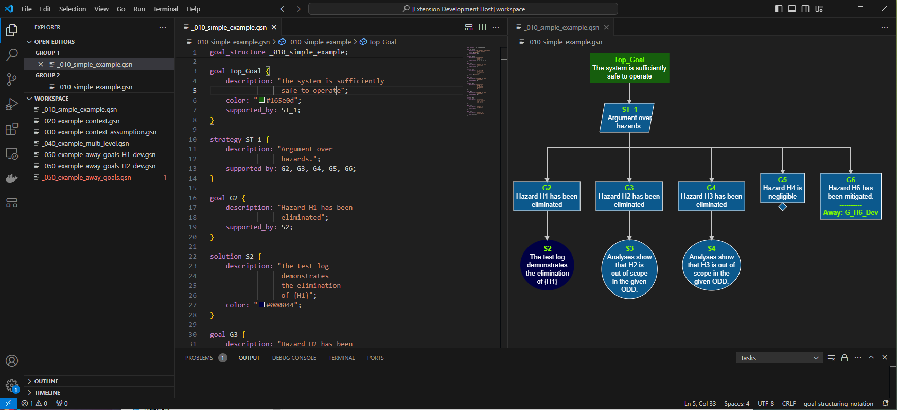

## Usage Example

After installing the VSCode plugin, create a file '_010_simple_example.gsn' and paste the code below. After that, right-click and select 'Open in Diagram' to visualize the diagram into another view.

```
goal_structure _010_simple_example;

goal Top_Goal {
    description: "The system is sufficiently 
                  safe to operate";
    color: "#165e0d";
    supported_by: ST_1;
}
                  
strategy ST_1 {
    description: "Argument over 
                  hazards.";
    supported_by: G2, G3, G4, G5, G6;
}

goal G2 {
    description: "Hazard H1 has been 
                  eliminated";
    supported_by: S2;
}

solution S2 {
    description: "The test log 
                  demonstrates
                  the elimination 
                  of {H1}";
    color: "#000044";
}

goal G3 {
    description: "Hazard H2 has been 
                  eliminated";
    supported_by: S3;
}

solution S3 {
    description: "Analyses show 
                  that H2 is 
                  out of scope 
                  in the given 
                  ODD.";
}

goal G4 {
    description: "Hazard H3 has been 
                  eliminated";
    supported_by: S4 ;
}

solution S4 {
    description: "Analyses show 
                  that H3 is out of
                  scope in the
                  given ODD.";
}

goal G5 {
    description: "Hazard H4 is 
                  negligible";
    undeveloped;
}

goal G6 {
    description: "Hazard H6 has
                  been mitigated.";
    away: G_H6_Dev;
}
```

